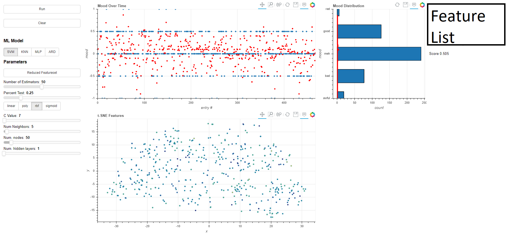
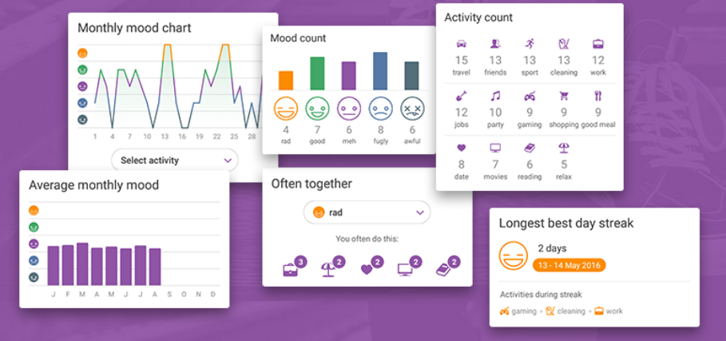
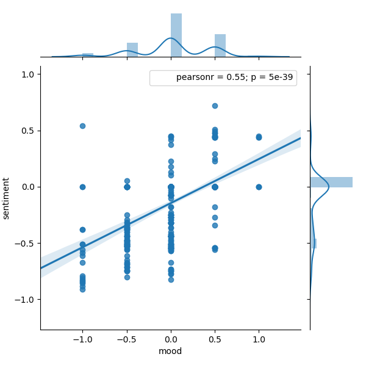
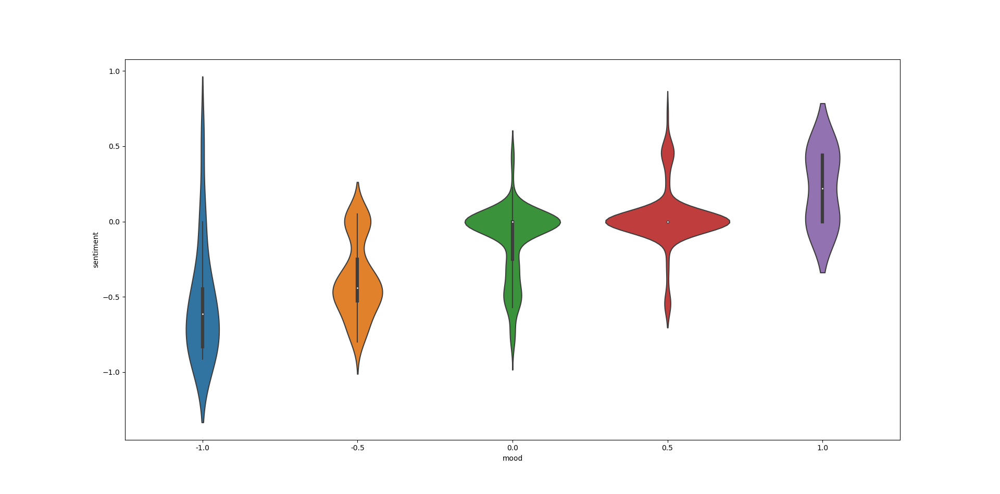
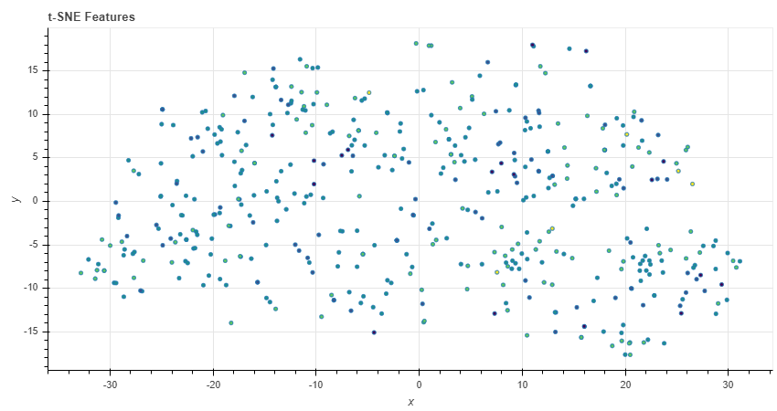
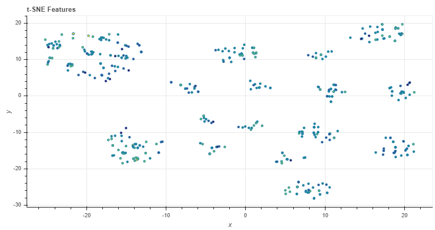

# daylio-analysis

## TL;DR Screenshot

### Running 

1. Put your Daylio Export CSV file in the `daylio_analysis` root folder. 
2. To run the bokeh server, find your `bokeh-script.py` file in your Python install's `Scripts` folder. Run with the parameters `serve --show <PATH-TO-web.py>`

## Info

Daylio is a simple smartphone app for tracking your daily mood, along with the activities you did that day and a short, optional memo. The app is quite flexible, allowing the user to add different moods, more activities, and (most importantly) see their statistics over time. 

However, many of the stats are limited by seemingly arbitrary restrictions. A calendar year-change causes a hard break in the data; you can't see your entire dataset from day 1 in a contiguous manner. However, Daylio offers the capability to export one's data as a `.csv` file. The data is almost perfectly formatted for Machine-Learning/Data Mining applications, so I decided to try taking a look at my own data to see if I could find any patterns using a methodology not available through the Daylio app.

I'd also just come off another Machine Learning project, the [Discord Social Graph](https://github.com/samclane/SocialGraphWebapp), where I'd used `mpld3` to convert `matplotlib` plots into `d3` interactive graphs. This was straightforward enough, but I'd heard about an "interactive visualization" library called [`bokeh`](https://bokeh.pydata.org/en/latest/). With `bokeh`, it was much more straightforward to create a plot and add controls/interactivity than with any `matplotlib`/`d3` plot. Using `bokeh`, I was able to generate a plot of my mood since I'd started using the app, >1 year ago. I could also visualize the output of my Machine Learning models by visualizing their predictions on top of the same dataset. I could also calculate cumulative statistics, like total mood counts (which, to be fair, Daylio can do, but again, not over periods >1 year).

Moods can easily be converted from categorical strings to ordinal numbers. They map nicely between [-1, 1]. Converting the moods to decimal numbers also allows for Regression Estimators to be used. This also allows error to be reduced, as the estimators can choose values between the discrete mood values. 

4 Different Models are supported:

* Support Vector Machine (SVM)
* K-Nearest Neighbors (KNN)
* Multi Layer Perceptron (MLP)
* Automatic Relevance Determination Regression (ARD)

One can also reduce the feature set to see which activities / features influence their mood the most. This is achieved through an `ExtraTreesRegressor` and `SelectFromModel`. This automatically finds the most influential features, and retrains the classifier on the given feature subset. This almost always reduces accuracy, but can give the user an impression of what affects their mood the most. 

Some derived features are also added to increase the dimensionality of a given sample. 

* Weekend
  * Binary value, 1 if day is "Saturday" or "Sunday"
* Yesterday
  * Float [-1, 1], gives the Ground Truth mood value of the previous sample. Changed the first sample's `NaN` to average mood
* Tomorrow
  * Float [-1, 1], gives the Ground Truth mood value of the next sample. Changed the last sample's `NaN` to average mood
  * This feature is non-causal (takes data from the future) and is for experimentation
* Sentiment
  * Float [-1, 1], the [VADER](http://www.nltk.org/howto/sentiment.html) sentiment score of the memo. Defaults to 0 if no memo is given that day
    * VADER is trained on social media data, and so is _very_ accurate, even with sarcasm, slang, and even emoticons/emoji
  * Unsurprisingly, this feature correlates _heavily_ with the mood value. Personal results and graphs will be shown below
  
A [Polynomial Feature Cross](https://scikit-learn.org/stable/modules/generated/sklearn.preprocessing.PolynomialFeatures.html) is also introduced to these engineered features, in an attempt to find feature-interactions or particularly strong features (by including the exponential components as well). 

Relevant parameters to the model and the feature selection can be changed with sliders on the left side of the webpage. After changing a parameter, the "Run" button must be pressed to re-run the fit-predict procedure on the model. 

## Results

As mentioned earlier, the most pertinent indicator of mood was the sentiment analysis of the sample's memo. Adding this feature gave my model an accuracy boost of ~20%, pretty much across the board. When doing feature reductions, `Sentiment^2` as well as `Sentiment` were always included in the results. The linear relationship between `mood` and `Sentiment` is best illustrated in this `seaborn` plot:

Using a Violin Plot, one can see that a negative mood almost always comes with a negative sentiment. This makes sense, as if my day is especially bad I tend to write about it. Conversely, if my day goes well I'm likely to write about it as well. Finally, I tend not to write anything on 'meh' days. If your day is unremarkable, you can't remark on it. 

As an additional form of feature visualization, I tried using t-SNE to project the features onto a 2D plot. Initially, this provides a pretty sparse representation:

However, if we use the "Reduce Featureset" button, a new pattern emerges:

Oftentimes the number of clusters in the plot corresponds with the number of features chosen by `SelectModel`. This shows high-dimensional data being successfully embedded in lower-dimensional space. Full disclosure, I'm still learning about t-SNE, so I can't fully explain the significance of this plot (yet). 